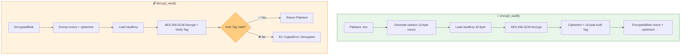
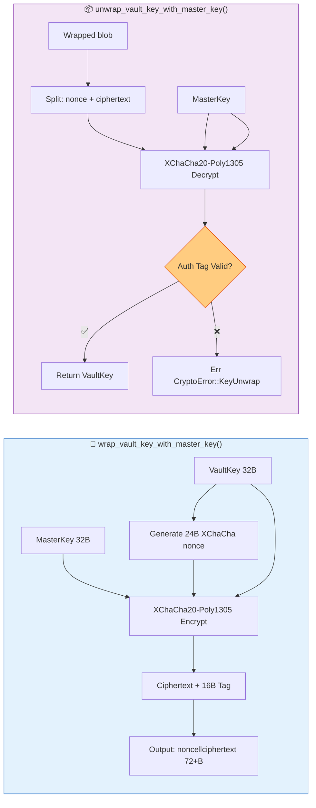
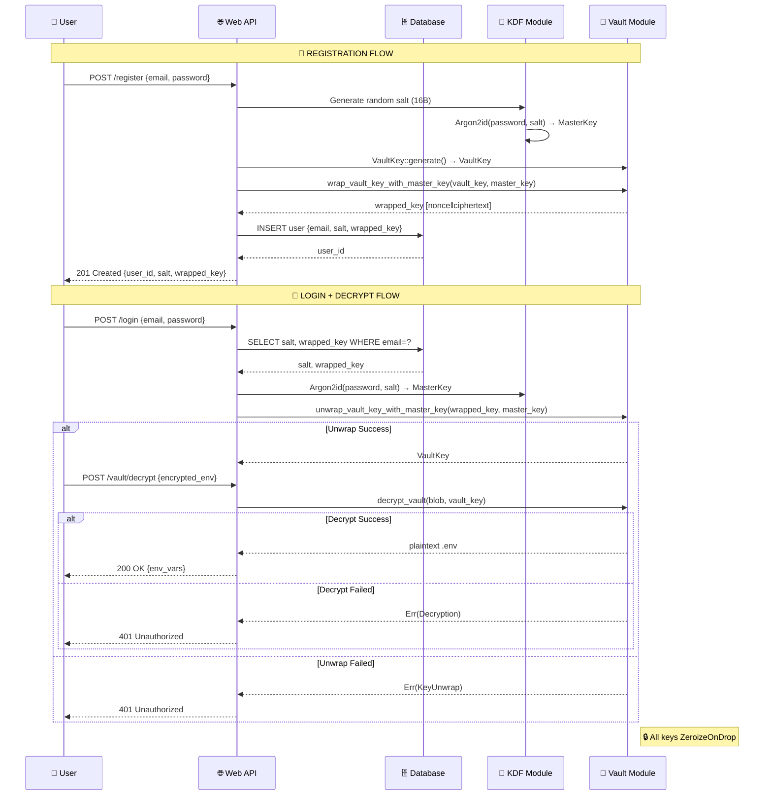
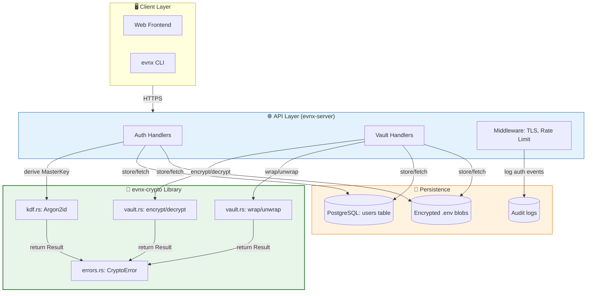
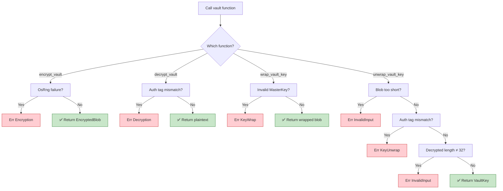
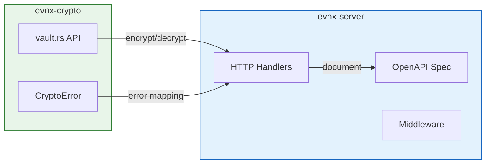

# 🛠️ Vault Module: Developer Integration Guide

> How to integrate `vault.rs` into your web server or `evnx` CLI application.

## 📋 Prerequisites Checklist

Before integrating the vault module, ensure:

- [ ] Rust toolchain ≥ 1.75 (for `ZeroizeOnDrop` derive)
- [ ] `evnx-crypto` crate added to `Cargo.toml`
- [ ] Secure random number generator available (`/dev/urandom` or OS equivalent)
- [ ] Sufficient entropy source for key generation
- [ ] Memory-safe deployment environment (no core dumps, swap encryption enabled)
- [ ] TLS enabled for any network transmission of encrypted data

```toml
# Cargo.toml
[dependencies]
evnx-crypto = { path = "../evnx-crypto" }  # or git/version
```

---

## 🔄 Typical Workflow Diagram

```
┌─────────────────┐
│  User Register  │
└────────┬────────┘
         │
         ▼
┌─────────────────┐
│ Derive MasterKey│ ← Argon2id(password + salt)
│ from password   │
└────────┬────────┘
         │
         ▼
┌─────────────────┐
│ Generate VaultKey│ ← OsRng 32-byte random
└────────┬────────┘
         │
         ▼
┌─────────────────┐
│ Wrap VaultKey   │ ← XChaCha20-Poly1305(MasterKey, VaultKey)
│ with MasterKey  │
└────────┬────────┘
         │
         ▼
┌─────────────────┐
│ Store in DB:    │
│ • wrapped_key   │ ← [nonce‖ciphertext]
│ • (optional)    │
│   encrypted_env │ ← [nonce‖ciphertext‖tag]
└────────┬────────┘
```

```
┌─────────────────┐
│  User Login     │
└────────┬────────┘
         │
         ▼
┌─────────────────┐
│ Re-derive       │
│ MasterKey       │ ← Same password + stored salt
└────────┬────────┘
         │
         ▼
┌─────────────────┐
│ Unwrap VaultKey │ ← XChaCha20-Poly1305⁻¹(MasterKey, wrapped)
└────────┬────────┘
         │
         ▼
┌─────────────────┐
│ Decrypt .env    │ ← AES-256-GCM⁻¹(VaultKey, blob)
│ Load config     │
└────────┬────────┘
```

---

## 🌐 Web Server Integration (Axum Example)

### Project Structure

```
src/
├── main.rs
├── handlers/
│   ├── auth.rs      # Login/register
│   ├── vault.rs     # Vault operations
│   └── mod.rs
├── state.rs         # App state with DB pool
└── crypto/
    └── vault_wrapper.rs  # Safe vault abstraction
```

### Step 1: Create a Safe Vault Wrapper

```rust
// src/crypto/vault_wrapper.rs
use evnx_crypto::vault::{VaultKey, encrypt_vault, decrypt_vault, 
                          wrap_vault_key_with_master_key, unwrap_vault_key_with_master_key};
use evnx_crypto::kdf::MasterKey;
use evnx_crypto::errors::CryptoError;

pub struct SecureVault {
    vault_key: VaultKey,
}

impl SecureVault {
    /// Create new vault for a user (registration flow)
    pub async fn create_for_user(
        password: &str,
        salt: &[u8],
    ) -> Result<(Self, Vec<u8>), CryptoError> {
        // Derive master key from password
        let master_key = MasterKey::derive_from_password(password, salt)
            .map_err(|e| CryptoError::KdfError(e))?;
        
        // Generate fresh vault key
        let vault_key = VaultKey::generate();
        
        // Wrap for storage
        let wrapped = wrap_vault_key_with_master_key(&vault_key, &master_key)?;
        
        Ok((Self { vault_key }, wrapped))
    }

    /// Unlock existing vault (login flow)
    pub async fn unlock(
        password: &str,
        salt: &[u8],
        wrapped_key: &[u8],
    ) -> Result<Self, CryptoError> {
        let master_key = MasterKey::derive_from_password(password, salt)
            .map_err(|e| CryptoError::KdfError(e))?;
        
        let vault_key = unwrap_vault_key_with_master_key(wrapped_key, &master_key)?;
        Ok(Self { vault_key })
    }

    /// Encrypt .env content
    pub fn encrypt_env(&self, env_content: &[u8]) -> Result<(Vec<u8>, Vec<u8>), CryptoError> {
        let blob = encrypt_vault(env_content, &self.vault_key)?;
        Ok((blob.nonce.to_vec(), blob.ciphertext))
    }

    /// Decrypt .env content
    pub fn decrypt_env(&self, nonce: &[u8], ciphertext: &[u8]) -> Result<Vec<u8>, CryptoError> {
        use evnx_crypto::vault::{EncryptedBlob, NONCE_LEN};
        
        if nonce.len() != NONCE_LEN {
            return Err(CryptoError::InvalidInput("invalid nonce length".into()));
        }
        
        let mut nonce_arr = [0u8; NONCE_LEN];
        nonce_arr.copy_from_slice(nonce);
        
        let blob = EncryptedBlob {
            nonce: nonce_arr,
            ciphertext: ciphertext.to_vec(),
        };
        
        decrypt_vault(&blob, &self.vault_key)
    }
}

// Zeroize vault key when wrapper is dropped
impl Drop for SecureVault {
    fn drop(&mut self) {
        // ZeroizeOnDrop handles this, but explicit drop is defensive
        use zeroize::Zeroize;
        self.vault_key.0.zeroize();
    }
}
```

### Step 2: Handler Example — Register User

```rust
// src/handlers/auth.rs
use axum::{extract::State, Json, http::StatusCode};
use serde::{Deserialize, Serialize};
use crate::state::AppState;
use crate::crypto::vault_wrapper::SecureVault;

#[derive(Deserialize)]
pub struct RegisterRequest {
    pub email: String,
    pub password: String,  // ⚠️ Ensure HTTPS!
}

#[derive(Serialize)]
pub struct RegisterResponse {
    pub user_id: String,
    pub salt: String,  // base64-encoded
    pub wrapped_key: String,  // base64-encoded
}

pub async fn register(
    State(state): State<AppState>,
    Json(req): Json<RegisterRequest>,
) -> Result<Json<RegisterResponse>, StatusCode> {
    // Generate cryptographically random salt
    let mut salt = [0u8; 16];
    rand::rngs::OsRng.fill_bytes(&mut salt);
    
    // Create vault and get wrapped key
    let (vault, wrapped) = SecureVault::create_for_user(&req.password, &salt)
        .await
        .map_err(|_| StatusCode::INTERNAL_SERVER_ERROR)?;
    
    // Store user in DB (pseudo-code)
    let user_id = state.db
        .create_user(&req.email, &salt, &wrapped)
        .await
        .map_err(|_| StatusCode::INTERNAL_SERVER_ERROR)?;
    
    // ⚠️ NEVER return raw bytes to client — use base64/hex
    Ok(Json(RegisterResponse {
        user_id,
        salt: base64::encode(salt),
        wrapped_key: base64::encode(wrapped),
    }))
}
```

### Step 3: Handler Example — Upload Encrypted Env

```rust
// src/handlers/vault.rs
use axum::{extract::State, Json, http::StatusCode, extract::Path};
use serde::Deserialize;
use crate::state::AppState;
use crate::crypto::vault_wrapper::SecureVault;

#[derive(Deserialize)]
pub struct UploadEnvRequest {
    pub env_content: String,  // Raw .env content (⚠️ HTTPS only!)
    pub password: String,     // For unlocking (consider session-based auth instead)
}

pub async fn upload_encrypted_env(
    State(state): State<AppState>,
    Path(user_id): Path<String>,
    Json(req): Json<UploadEnvRequest>,
) -> Result<StatusCode, StatusCode> {
    // Fetch user's salt and wrapped key from DB
    let (salt, wrapped) = state.db
        .get_user_credentials(&user_id)
        .await
        .map_err(|_| StatusCode::NOT_FOUND)?;
    
    // Unlock vault
    let vault = SecureVault::unlock(&req.password, &salt, &wrapped)
        .await
        .map_err(|_| StatusCode::UNAUTHORIZED)?;
    
    // Encrypt
    let (nonce, ciphertext) = vault
        .encrypt_env(req.env_content.as_bytes())
        .map_err(|_| StatusCode::BAD_REQUEST)?;
    
    // Store encrypted blob in DB
    state.db
        .store_encrypted_env(&user_id, &nonce, &ciphertext)
        .await
        .map_err(|_| StatusCode::INTERNAL_SERVER_ERROR)?;
    
    Ok(StatusCode::CREATED)
}
```

### Step 4: Middleware for Secure Headers

```rust
// src/middleware/security.rs
use axum::middleware::Next;
use axum::response::Response;
use axum::http::{Request, header};

pub async fn security_headers<B>(
    mut req: Request<B>,
    next: Next<B>,
) -> Response {
    // Prevent caching of sensitive responses
    req.headers_mut().insert(
        header::CACHE_CONTROL,
        header::HeaderValue::from_static("no-store, no-cache, must-revalidate"),
    );
    req.headers_mut().insert(
        header::PRAGMA,
        header::HeaderValue::from_static("no-cache"),
    );
    
    // HSTS, CSP, etc.
    let mut res = next.run(req).await;
    res.headers_mut().insert(
        header::STRICT_TRANSPORT_SECURITY,
        header::HeaderValue::from_static("max-age=31536000; includeSubDomains"),
    );
    res
}
```

---

## 💻 CLI Integration (`evnx` CLI Example)

### Command: `evnx vault init`

```rust
// src/commands/vault/init.rs
use clap::Args;
use evnx_crypto::vault::{VaultKey, wrap_vault_key_with_master_key};
use evnx_crypto::kdf::MasterKey;
use rpassword::prompt_password;  // Secure password input

#[derive(Args)]
pub struct InitArgs {
    /// Path to .env file to encrypt
    #[arg(short, long)]
    pub input: String,
    
    /// Output path for encrypted vault
    #[arg(short, long)]
    pub output: String,
}

pub async fn run(args: InitArgs) -> Result<(), Box<dyn std::error::Error>> {
    // Read plaintext .env
    let env_content = std::fs::read(&args.input)?;
    
    // Prompt for password securely
    eprint!("Enter vault password: ");
    let password = prompt_password("")?;
    
    // Generate salt and derive master key
    let mut salt = [0u8; 16];
    rand::rngs::OsRng.fill_bytes(&mut salt);
    
    let master_key = MasterKey::derive_from_password(&password, &salt)?;
    let vault_key = VaultKey::generate();
    
    // Encrypt env content
    let blob = evnx_crypto::vault::encrypt_vault(&env_content, &vault_key)?;
    
    // Wrap vault key
    let wrapped = wrap_vault_key_with_master_key(&vault_key, &master_key)?;
    
    // Serialize vault file (custom format or JSON)
    let vault_file = VaultFile {
        version: 1,
        salt: salt.to_vec(),
        nonce: blob.nonce.to_vec(),
        ciphertext: blob.ciphertext,
        wrapped_key: wrapped,
    };
    
    let output = serde_json::to_vec(&vault_file)?;
    std::fs::write(&args.output, output)?;
    
    // Zeroize sensitive data (automatic via ZeroizeOnDrop, but explicit is good)
    drop(password);
    drop(master_key);
    drop(vault_key);
    
    println!("✅ Vault created: {}", args.output);
    Ok(())
}

#[derive(serde::Serialize, serde::Deserialize)]
struct VaultFile {
    version: u32,
    salt: Vec<u8>,
    nonce: Vec<u8>,
    ciphertext: Vec<u8>,
    wrapped_key: Vec<u8>,
}
```

### Command: `evnx vault decrypt`

```rust
// src/commands/vault/decrypt.rs
use clap::Args;
use evnx_crypto::vault::{EncryptedBlob, decrypt_vault, unwrap_vault_key_with_master_key};
use evnx_crypto::kdf::MasterKey;
use rpassword::prompt_password;

#[derive(Args)]
pub struct DecryptArgs {
    /// Path to encrypted vault file
    #[arg(short, long)]
    pub input: String,
    
    /// Output path for decrypted .env
    #[arg(short, long)]
    pub output: Option<String>,
}

pub async fn run(args: DecryptArgs) -> Result<(), Box<dyn std::error::Error>> {
    // Load vault file
    let data = std::fs::read(&args.input)?;
    let vault_file: VaultFile = serde_json::from_slice(&data)?;
    
    // Prompt for password
    eprint!("Enter vault password: ");
    let password = prompt_password("")?;
    
    // Derive master key and unwrap vault key
    let master_key = MasterKey::derive_from_password(&password, &vault_file.salt)?;
    let vault_key = unwrap_vault_key_with_master_key(&vault_file.wrapped_key, &master_key)?;
    
    // Decrypt
    let blob = EncryptedBlob {
        nonce: vault_file.nonce.try_into()
            .map_err(|_| "invalid nonce length")?,
        ciphertext: vault_file.ciphertext,
    };
    
    let plaintext = decrypt_vault(&blob, &vault_key)?;
    
    // Output
    match &args.output {
        Some(path) => std::fs::write(path, &plaintext)?,
        None => print!("{}", String::from_utf8_lossy(&plaintext)),
    }
    
    Ok(())
}
```

---

## 🔐 Best Practices Checklist

### ✅ Key Management
- [ ] Generate `VaultKey` with `VaultKey::generate()` — never hardcode
- [ ] Wrap `VaultKey` with user's `MasterKey` before any storage
- [ ] Store `salt` and `wrapped_key` separately from encrypted data
- [ ] Rotate `VaultKey` periodically (re-encrypt data with new key)

### ✅ Encryption Usage
- [ ] Always use `encrypt_vault()` — never implement AES-GCM manually
- [ ] Never reuse nonces (handled automatically, but don't override)
- [ ] Validate all inputs before encryption (length, encoding)
- [ ] Handle `CryptoError` explicitly — never ignore decryption failures

### ✅ Memory Safety
- [ ] Use `ZeroizeOnDrop` types — avoid `Clone` on keys
- [ ] Minimize lifetime of plaintext in memory
- [ ] Avoid logging any part of keys, passwords, or ciphertext
- [ ] Disable core dumps in production: `ulimit -c 0`

### ✅ Network & Storage
- [ ] Always transmit encrypted data over TLS 1.3+
- [ ] Use constant-time comparison for password verification (handled by Argon2)
- [ ] Encrypt database at rest (TDE) in addition to application-layer encryption
- [ ] Implement rate limiting on auth endpoints to prevent brute-force

### ✅ Testing & Auditing
- [ ] Run `cargo test --test vault` in CI/CD pipeline
- [ ] Enable `proptest` with high iteration count in staging
- [ ] Log decryption failures (not successes) for anomaly detection
- [ ] Conduct annual cryptographic review with security team

---

## 🚨 Common Pitfalls & Solutions

| Pitfall | Symptom | Solution |
|---------|---------|----------|
| **Reusing VaultKey across users** | One compromised key → all users' data exposed | Generate unique `VaultKey` per vault/user |
| **Storing password-derived key directly** | Password change requires re-encrypting all data | Use two-layer: `MasterKey` (password) → `VaultKey` (data) |
| **Logging ciphertext for debugging** | Keys/leaks in logs → total compromise | Use structured logging with redaction; never log crypto material |
| **Ignoring decryption errors** | Silent failures → corrupted state or security bypass | Always match on `Result` and handle `CryptoError::Decryption` |
| **Using weak password without KDF** | Brute-force attacks succeed | Always use `MasterKey::derive_from_password()` (Argon2id) |
| **Not zeroizing keys** | Keys remain in heap/swap → forensic recovery | Rely on `ZeroizeOnDrop`; avoid `clone()` on key types |

---

## 🧪 Testing Your Integration

```rust
// tests/integration_vault.rs
use evnx_crypto::vault::{VaultKey, encrypt_vault, decrypt_vault};
use evnx_crypto::kdf::MasterKey;

#[tokio::test]
async fn test_web_flow_register_login_encrypt_decrypt() {
    // 1. Register: derive master key, generate vault key, wrap
    let salt = b"test_salt_123456";
    let password = "correct_horse_battery_staple";
    
    let master_key = MasterKey::derive_from_password(password, salt).unwrap();
    let vault_key = VaultKey::generate();
    let wrapped = evnx_crypto::vault::wrap_vault_key_with_master_key(
        &vault_key, &master_key
    ).unwrap();
    
    // 2. Encrypt env
    let env = b"API_KEY=sk-test-123\n";
    let blob = encrypt_vault(env, &vault_key).unwrap();
    
    // 3. Simulate login: re-derive master key, unwrap vault key
    let master_key2 = MasterKey::derive_from_password(password, salt).unwrap();
    let unwrapped = evnx_crypto::vault::unwrap_vault_key_with_master_key(
        &wrapped, &master_key2
    ).unwrap();
    
    // 4. Decrypt
    let decrypted = decrypt_vault(&blob, &unwrapped).unwrap();
    assert_eq!(env, &decrypted[..]);
}

#[test]
fn test_wrong_password_fails_gracefully() {
    let salt = b"test_salt_123456";
    let master_key = MasterKey::derive_from_password("real_password", salt).unwrap();
    let vault_key = VaultKey::generate();
    let wrapped = evnx_crypto::vault::wrap_vault_key_with_master_key(
        &vault_key, &master_key
    ).unwrap();
    
    // Try to unwrap with wrong password
    let wrong_master = MasterKey::derive_from_password("wrong_password", salt).unwrap();
    let result = evnx_crypto::vault::unwrap_vault_key_with_master_key(
        &wrapped, &wrong_master
    );
    
    assert!(matches!(result, Err(evnx_crypto::errors::CryptoError::KeyUnwrap)));
}
```

---

## 📦 Deployment Checklist

### Production Server
- [ ] Compile with `--release` and `panic = "abort"` for smaller binaries
- [ ] Enable ASLR, stack canaries, RELRO (`cargo build` defaults are good)
- [ ] Run as non-root user with minimal permissions
- [ ] Mount `/tmp` and swap with `noexec,nosuid`
- [ ] Use `systemd` or supervisor with automatic restart on crash
- [ ] Monitor for `CryptoError::Decryption` spikes (potential attack)

### CLI Distribution
- [ ] Sign releases with GPG/Minisign
- [ ] Provide SHA256 checksums for downloads
- [ ] Document system requirements (OS, Rust version if building from source)
- [ ] Include `--help` and examples in CLI output

### Compliance Notes
- 🔒 **GDPR/CCPA**: Encrypted `.env` containing PII qualifies as "pseudonymized"; document key management
- 🔒 **SOC 2**: Log key derivation attempts, decryption failures, and key rotation events
- 🔒 **HIPAA**: Ensure BAAs cover cryptographic key handling; audit access to `MasterKey` derivation

---

## 🆘 Troubleshooting

### `CryptoError::Decryption` on valid input
```rust
// Check:
// 1. Is the VaultKey correct? (unwrap succeeded?)
// 2. Was ciphertext modified in transit/storage?
// 3. Is nonce matching the one used during encryption?
// 4. Are you using the same AES-GCM parameters? (don't mix libraries)

// Debug tip (development only!):
#[cfg(debug_assertions)]
eprintln!("Decryption failed: nonce={:x?}, ct_len={}", 
          blob.nonce, blob.ciphertext.len());
```

### Performance concerns with Argon2id
```rust
// Tune parameters based on hardware:
use evnx_crypto::kdf::{MasterKey, KdfParams};

let params = KdfParams {
    memory_cost: 19456,  // ~19 MB (default)
    time_cost: 2,        // 2 iterations
    parallelism: 1,      // 1 thread
};

let master_key = MasterKey::derive_from_password_with_params(
    password, salt, &params
)?;
```

### "Wrapped key too short" error
```rust
// Ensure you're storing the FULL output of wrap_vault_key_with_master_key:
// [24-byte nonce][ciphertext (32+16 bytes minimum)]
// Total: ≥ 72 bytes

// Debug:
assert!(wrapped.len() >= 72, "wrapped key truncated: {} bytes", wrapped.len());
```

---

## 📚 Further Reading

- [RFC 5116: AES-GCM](https://datatracker.ietf.org/doc/html/rfc5116)
- [XChaCha20-Poly1305 IETF Draft](https://datatracker.ietf.org/doc/html/draft-irtf-cfrg-xchacha)
- [Argon2 RFC 9106](https://datatracker.ietf.org/doc/html/rfc9106)
- [RustCrypto: `aes-gcm`](https://docs.rs/aes-gcm)
- [Zeroize crate docs](https://docs.rs/zeroize)
- [OWASP Cryptographic Storage Cheat Sheet](https://cheatsheetseries.owasp.org/cheatsheets/Cryptographic_Storage_Cheat_Sheet.html)

---

> 💡 **Pro Tip**: When in doubt, assume an attacker has read access to your database and logs. Design your system so that **only the user's password** can unlock their data — never store plaintext keys, never log secrets, and always authenticate before decrypting.


---

# 🔐 Vault Module: Mermaid Diagrams & Architecture Clarification

---

## 📊 Mermaid Diagrams

### 1️⃣ Core Encryption/Decryption Flow



---

### 2️⃣ Key Wrapping/Unwrapping Flow (Two-Layer Key Management)



---

### 3️⃣ Full User Workflow: Registration → Login → Decrypt



---

### 4️⃣ Data Flow & Component Boundaries



---

### 5️⃣ Error Handling Decision Tree



---

## ❓ Are Web Endpoint Specs Related to Vault?

### ✅ Short Answer: **Separate Concerns, Connected Interface**

The **vault module** and **web endpoint specs** are **architecturally separate**, but they interface at well-defined boundaries.

```
┌─────────────────────────────────────────┐
│  🔐 evnx-crypto (Library Crate)         │
│  • Pure cryptography: no I/O, no HTTP   │
│  • Functions: encrypt_vault, decrypt_...│
│  • Types: VaultKey, EncryptedBlob       │
│  • Errors: CryptoError enum             │
│  • Testable in isolation                │
└────────────────┬────────────────────────┘
                 │ uses
                 ▼
┌─────────────────────────────────────────┐
│  🌐 evnx-server (Binary Crate)          │
│  • HTTP API: Axum/Actix handlers        │
│  • Business logic: auth, vault ops      │
│  • I/O: Database, filesystem, network   │
│  • OpenAPI/Swagger specs for endpoints  │
└─────────────────────────────────────────┘
```

---

### 🔗 How They Connect



**The vault module provides:**
- `encrypt_vault()` → used by `POST /vault/encrypt` handler
- `decrypt_vault()` → used by `POST /vault/decrypt` handler  
- `wrap_vault_key_with_master_key()` → used by `POST /register`
- `CryptoError` → mapped to HTTP status codes (401, 400, 500)

**The web spec defines:**
- Request/response schemas (JSON)
- Authentication requirements (JWT, API key)
- Rate limits, CORS, content-type
- **Not** cryptographic details (those stay in `evnx-crypto`)

---

### 📋 Example: Endpoint Spec Snippet (OpenAPI 3.0)

```yaml
# docs/openapi.yaml — Web layer only
paths:
  /vault/decrypt:
    post:
      summary: Decrypt an encrypted .env blob
      security: [{ bearerAuth: [] }]
      requestBody:
        required: true
        content:
          application/json:
            schema:
              type: object
              properties:
                nonce:
                  type: string
                  format: base64
                  maxLength: 16  # 12 bytes → base64
                ciphertext:
                  type: string
                  format: base64
      responses:
        '200':
          description: Decrypted .env content
          content:
            text/plain:
              schema:
                type: string
        '401':
          description: Invalid key or tampered data
          content:
            application/json:
              schema:
                $ref: '#/components/schemas/Error'
        '400':
          description: Malformed request

components:
  schemas:
    Error:
      type: object
      properties:
        code:
          type: string
          enum: [DECRYPTION_FAILED, INVALID_INPUT]
        message:
          type: string
```

> 🔐 **Note**: The OpenAPI spec mentions `nonce` and `ciphertext` as base64 strings, but **never** documents:
> - The AES-GCM algorithm (implementation detail)
> - Key derivation parameters (security through obscurity ≠ good, but don't expose internals)
> - Internal error variants like `CryptoError::KeyUnwrap` (map to generic `401`)

---

### 🧱 Recommended Project Structure

```
evnx/
├── crates/
│   ├── evnx-crypto/          # 🔐 Library crate (NO HTTP)
│   │   ├── Cargo.toml
│   │   ├── src/
│   │   │   ├── vault.rs      # encrypt/decrypt, wrap/unwrap
│   │   │   ├── kdf.rs        # Argon2id derivation
│   │   │   ├── errors.rs     # CryptoError
│   │   │   └── lib.rs
│   │   └── tests/
│   │       └── vault.rs      # Unit + proptest
│   │
│   └── evnx-server/          # 🌐 Binary crate (HTTP API)
│       ├── Cargo.toml
│       ├── src/
│       │   ├── main.rs
│       │   ├── handlers/
│       │   │   ├── auth.rs   # Uses evnx_crypto::kdf
│       │   │   └── vault.rs  # Uses evnx_crypto::vault
│       │   ├── middleware/
│       │   └── openapi.yaml  # ← Web endpoint specs HERE
│       └── tests/
│           └── integration.rs
│
├── docs/
│   ├── VAULT.md           # Crypto module docs
│   ├── VAULT_DEVELOPER_GUIDE.md  # Integration guide
│   └── API_REFERENCE.md          # OpenAPI-generated docs
│
└── Cargo.toml  # Workspace root
```

---

### ✅ Separation of Concerns Checklist

| Concern | Belongs In | Why |
|---------|-----------|-----|
| AES-GCM encryption logic | `evnx-crypto` | Reusable, testable, no I/O dependencies |
| HTTP request parsing | `evnx-server` | Framework-specific (Axum/Actix) |
| Argon2id parameters | `evnx-crypto` | Security-critical, versioned separately |
| Rate limiting middleware | `evnx-server` | Deployment/config concern |
| `CryptoError` enum | `evnx-crypto` | Shared error semantics |
| HTTP status code mapping | `evnx-server` | API contract concern |
| OpenAPI/Swagger spec | `evnx-server/docs` | Consumer-facing documentation |
| Key zeroization | `evnx-crypto` | Memory safety primitive |
| Database schema for blobs | `evnx-server` | Persistence layer concern |

---

### 🔄 Interface Contract Between Layers

```rust
// evnx-server/src/handlers/vault.rs
use evnx_crypto::vault::{encrypt_vault, decrypt_vault, CryptoError};

// ✅ Good: Handler uses only public vault API
pub async fn decrypt_handler(
    nonce_b64: String,
    ct_b64: String,
    vault_key: VaultKey,  // From session/auth
) -> Result<String, ApiError> {
    let nonce = base64_decode(&nonce_b64)?;
    let ciphertext = base64_decode(&ct_b64)?;
    
    let blob = EncryptedBlob {
        nonce: nonce.try_into().map_err(|_| ApiError::BadRequest)?,
        ciphertext,
    };
    
    // Delegate crypto to library
    let plaintext = decrypt_vault(&blob, &vault_key)
        .map_err(|e| match e {
            CryptoError::Decryption => ApiError::Unauthorized,
            CryptoError::InvalidInput(_) => ApiError::BadRequest,
            _ => ApiError::Internal,
        })?;
    
    String::from_utf8(plaintext).map_err(|_| ApiError::BadRequest)
}
```

```yaml
# evnx-server/docs/openapi.yaml
# ✅ Good: Spec describes interface, not implementation
/vault/decrypt:
  post:
    # ...
    # No mention of AES-GCM, nonces length, or auth tags
    # Consumers only need to know: send base64 nonce+ciphertext
```

---

## 🎯 Key Takeaways

1. **`evnx-crypto` is a pure library** — no HTTP, no I/O, just cryptography. Test it in isolation.
2. **`evnx-server` is the application** — handles HTTP, auth, business logic, and *uses* the crypto library.
3. **OpenAPI specs live in the server crate** — they document the *interface*, not the crypto internals.
4. **Error mapping is the bridge** — `CryptoError` → HTTP status codes happens in handlers, not in `vault.rs`.
5. **Security boundaries matter** — never let HTTP parsing logic touch raw keys; always go through the vault API.

This separation enables:
- ✅ Independent testing of cryptography
- ✅ Swapping HTTP frameworks without touching crypto
- ✅ Auditing crypto code without web framework noise
- ✅ Reusing `evnx-crypto` in CLI, server, or other binaries


